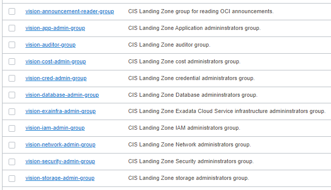

# OCI Groups Module Usage Example - CIS Landing Zone Quick Start

## Introduction

This example shows how to deploy CIS Landing Zone Quick Start groups in Oracle Cloud Infrastructure.

It creates the following groups as shown in the picture below:



## Using this example
1. Prepare one variable file named *terraform.tfvars* with the required information for authenticating to OCI. The contents of *terraform.tfvars* should look something like the following (or copy and re-use the contents of *terraform.tfvars.template*):

```
### TENANCY DETAILS
#
# Get this from OCI Console (after logging in, go to top-right-most menu item and click option "Tenancy: <your tenancy name>").
tenancy_id="<tenancy OCID>"
#
# Get this from OCI Console (after logging in, go to top-right-most menu item and click option "My profile").
user_id="<user OCID>"
#
# The fingerprint can be gathered from your user account. In the "My profile page, click "API keys" on the menu in left hand side).
fingerprint="<PEM key fingerprint>"
#
# This is the full path on your local system to the private key used for the API signing key pair.
private_key_path="<path to the private key that matches the fingerprint above>"
#
# This is the password that protects the private key, if any.
private_key_password=""
#
# This is your tenancy home region.
home_region="<your tenancy home region>"
```

2. Check the provided *input.auto.tfvars* file. It has a single map variable named *groups*. 

**Caution**: Within the map, each object is identified by a key (in uppercase), like *IAM-ADMIN-GROUP*, *CRED-ADMIN-GROUP*, *SECURITY-ADMIN-GROUP*, etc. These can actually be any strings, but once defined they MUST NOT be changed, or Terraform will try to recreate the groups upon *terraform apply*.

```
groups = {  
  IAM-ADMIN-GROUP  : { 
    name : "vision-iam-admin-group",  
    description : "CIS Landing Zone IAM administrators group.",      
    members : [], 
    defined_tags : null, 
    freeform_tags : null
  },
  CRED-ADMIN-GROUP  : { 
    name : "vision-cred-admin-group",  
    description : "CIS Landing Zone credential administrators group.",      
    members : [], 
    defined_tags : null, 
    freeform_tags : null
  },  
  COST-ADMIN-GROUP  : { 
    name : "vision-cost-admin-group",  
    description : "CIS Landing Zone cost administrators group.",      
    members : [], 
    defined_tags : null, 
    freeform_tags : null
  },                                        
  NETWORK-ADMIN-GROUP  : { 
    name : "vision-network-admin-group",  
    description : "CIS Landing Zone Network administrators group.",      
    members : [], 
    defined_tags : null, 
    freeform_tags : null
  },
  SECURITY-ADMIN-GROUP : { 
    name : "vision-security-admin-group", 
    description : "CIS Landing Zone Security admininstrators group.",    
    members : [], 
    defined_tags : null, 
    freeform_tags : null
  },
  APP-ADMIN-GROUP      : { 
    name : "vision-app-admin-group",      
    description : "CIS Landing Zone Application admininstrators group.", 
    members : [], 
    defined_tags : null, 
    freeform_tags : null
  },
  DATABASE-ADMIN-GROUP : { 
    name : "vision-database-admin-group", 
    description : "CIS Landing Zone Database admininstrators group.",    
    members : [], 
    defined_tags : null, 
    freeform_tags : null
  },
  EXAINFRA-ADMIN-GROUP : { 
    name : "vision-exainfra-admin-group", 
    description : "CIS Landing Zone Exadata Cloud Service infrastructure admininstrators group.", 
    members : [], 
    defined_tags : null, 
    freeform_tags : null
  },
  STORAGE-ADMIN-GROUP  : { 
    name : "vision-storage-admin-group",  
    description : "CIS Landing Zone storage administrators group.",      
    members : [], 
    defined_tags : null, 
    freeform_tags : null
  }, 
  AUDITOR-GROUP  : { 
    name : "vision-auditor-group",  
    description : "CIS Landing Zone auditor group.",      
    members : [], 
    defined_tags : null, 
    freeform_tags : null
  },    
  ANNOUNCEMENT-READER-GROUP  : { 
    name : "vision-announcement-reader-group",  
    description : "CIS Landing Zone group for reading OCI announcements.",      
    members : [], 
    defined_tags : null, 
    freeform_tags : null
  }                                                                
}  
```

3. Check the provided *main.tf* file. It calls the underlying tags module for resource management. 

`main.tf`:

```
module "cislz_groups" {
  source       = "../../"
  tenancy_id   = var.tenancy_id
  groups       = var.groups
}
```

4. Then execute the example using the usual Terraform workflow:

```
$ terraform init
$ terraform plan
$ terraform apply
```